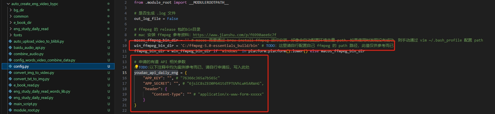
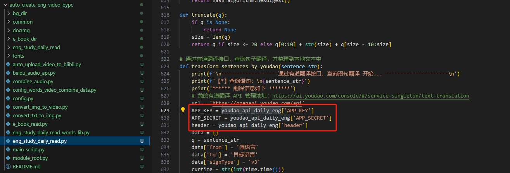

# “英文txt文档” 秒变 “英语教学视频”

* 直接在 PC 端通过 python 的各种工具包制作英语文章学习视频
* [效果演示视频](https://www.bilibili.com/video/BV19b4y1H7wR/?vd_source=70eab574cc508f954057839eef5f52b6)

## 使用说明
* 安装 ffmpeg（这里不做详述）
* 前往 有道翻译官方 申请翻译 API Key 相关参数，用于单词翻译
* 安装这里所需的 python 工具包
* 在 config 中配置 ffmpeg 路径、有道翻译 API Key 等相关参数
* 在 baidu_audio_api.py 中修改语言 API Key 等相关参数
* 以上配置都顺利完成后，则可以 cd 进入到该目录下，执行指令 python main_script.py 根据终端提示进行操作即可

## 注意项

##### 有道翻译 API Key 申请注意项
* 若申请到的有道翻译 API Key 与代码中配置存在差异，则需要自行修改相关代码
* config.py 中是使用的有道翻译 API Key 的配置参考案例，具体参数要根据最新的有道官方的 API Key 为准
* 
* 若发现自己申请到的有道 API Key 配置参数与这里的不同，则请根据实际参数修改这里的请求代码
* 

##### python 工具包安装注意项
* 如果在执行脚本过程中，终端提示缺少部分工具包的话，根据终端提示进行安装即可，若遇到提示中提到的工具包安装不到，则可以网上查找相关资料去正确安装相应的工具包即可